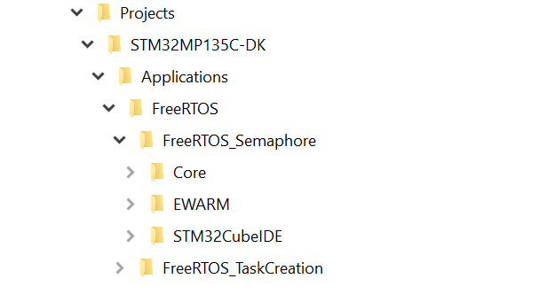

# X-CUBE-FREERTOS-MPU FreeRTOS Software Expansion for STM32Cube

With FreeRTOS complementing the extensive STM32Cube ecosystem providing free development tools, software bricks, and software expansion packages, STM32 users can also leverage the rich services of FreeRTOS which meet the needs of tiny, smart, connected devices.

**X-CUBE-FREERTOS** (FreeRTOS RTOS Software Expansion for STM32Cube) provides a full integration of **FreeRTOS** in the STM32Cube environment for the STM32CUBEMP13 series of microprocessors. Ready-to-run applicative examples are also provided for the *STM32MP135F_DK* thus **reducing the learning curve** and ensuring a **smooth application development experience** with FreeRTOS RTOS and STM32CubeMP13 MPU.

### Prerequisites
- None

One of the following toolchains:

- IAR Embedded Workbench for ARM (EWARM) toolchain 9.50.1 + ST-LINKV3
- [STM32CubeIDE V1.15.0](https://www.st.com/en/development-tools/stm32cubeide.html)  + ST-LINKV3

## Supported Devices and Boards by applications
- [STM32MP135F](https://www.st.com/en/evaluation-tools/stm32mp135f-dk.html)

## Repository structure
The STMicroelectronics GitHub X-CUBE-FREERTOS-MPU repository consists of the following repositories:
- **Drivers**: contains STM32CUBEMP13 BSP, CMSIS and HAL drivers.
- **Middlewares**: contains FreeRTOS Middleware files.
- **Projects**: provides ready-to-run applicative examples for FreeRTOS RTOS on the supported boards. Projects are structured as follows:

## Documentation
More comprehensive documentation is available on FreeRTOS [FreeRTOS documentation](https://freertos.org/Documentation/RTOS_book.html).

## License
 None

## Release note

Details about the content of this release are available in the release note [here](https://htmlpreview.github.io/?https://github.com/STMicroelectronics/x-cube-freertos-mpu/blob/main/Release_Notes.html).

## Applications

| STM32CUBEMP13 Applications                                |       Short Description      |
|---------------------------------------------------- |----------------------------------------------------------------|
| FreeRTOS_Semaphore                                  | This application creates two threads that toggle LEDs through a shared semaphore. [readme](./Projects/STM32MP135C-DK/Applications/FreeRTOS/FreeRTOS_Semaphore/README.md) |
| FreeRTOS_TaskCreation                               | This application creates two threads with the same priority, which execute in a periodic cycle of 15 seconds. [readme](./Projects/STM32MP135C-DK/Applications/FreeRTOS/FreeRTOS_TaskCreation/README.md) |

## Troubleshooting
**Caution**  : The issues are  **strictly limited**  to submit problems or suggestions related to the software delivered in this repository.

**For any other question**  related to the product, the hardware performance or characteristics, the tools, the environment, you can submit it to the  **ST Community**  on the STM32 MPUs related  [page](https://community.st.com/t5/stm32-mpus-products/bd-p/stm32-mpu-products-forum).

